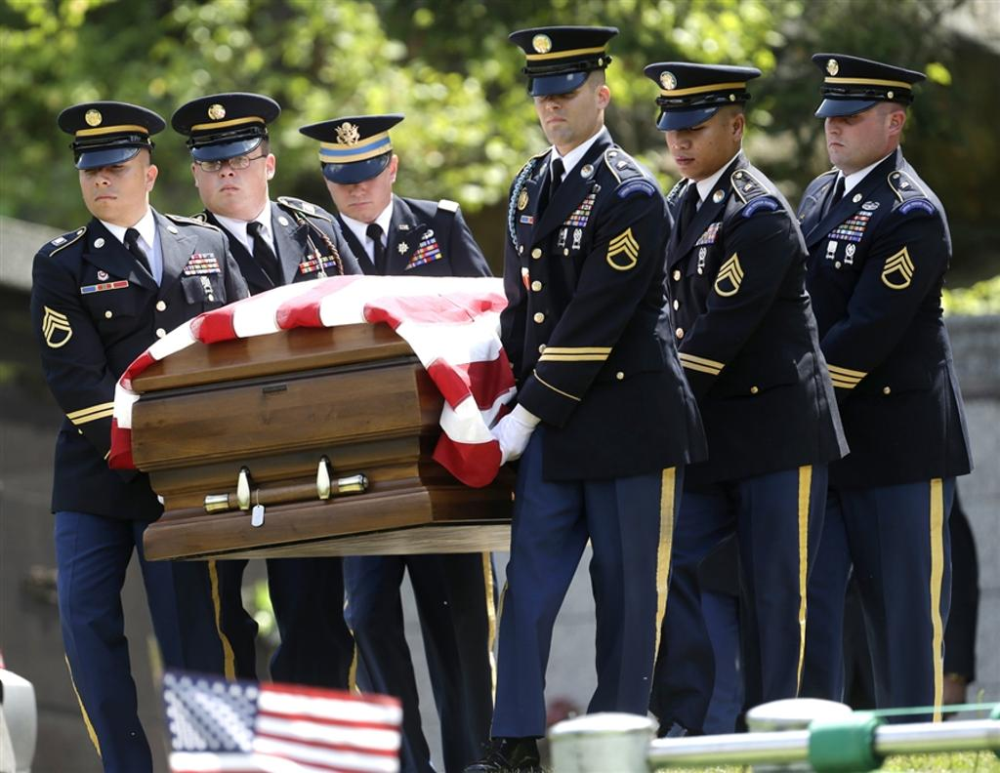
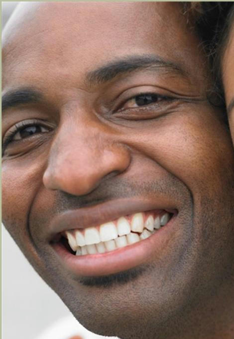

````markdown
# Rust Face Detection & Dataset Generator

A high-performance, robust Rust application for detecting faces in a large batch of images and generating a clean, cropped face dataset. This tool is built for efficiency and reliability, leveraging Rust's performance and safety features to process the WIDER FACE dataset and produce over 18,000 cropped faces from ~3,200 images.

## My Thinking & Approach

For this task, my goal was to build a production-quality tool that is not only fast but also exceptionally robust. I prioritized handling the messy reality of raw model output by implementing a multi-stage pipeline: first, efficiently decoding the model's complex, transposed array structure; second, using Non-Max Suppression (NMS) to de-noise thousands of overlapping detections into single, high-confidence results; and finally, employing safe math and boundary checks to prevent panics during image cropping. The entire process is wrapped in a command-line application distributed as a self-contained Linux binary via GitHub Releases, demonstrating a complete, production-ready workflow.

## Sample Results

Here are a few examples of the program's output. More samples can be found in the `/assets` folder.

**Input Image 1**


**Cropped Faces Generated by this Program**


**Input Image 2**


**Cropped Faces Generated by this Program**



## Features

* **High-Performance Detection:** Utilizes the lightweight `yolov11n-face` ONNX model for fast and accurate inference.
* **Robust Data Processing:** Intelligently decodes complex model output and sanitizes detections.
* **Recursive Image Loading:** Automatically finds all images in a directory and its subdirectories.
* **Advanced Filtering:** Implements Non-Max Suppression (NMS) to eliminate duplicate and noisy bounding boxes.
* **Safe Cropping:** Prevents runtime errors with built-in safety checks for image boundaries and dimensions.
* **Cross-Platform:** Built in Rust and distributed as a self-contained Linux binary using Docker.

## Download & Run the Program

A ready-to-run Linux binary is available for download. No installation of Rust or other dependencies is required.

1.  **Download the Package:**
    Go to the [**GitHub Releases Page**](https://github.com/r4plh/rustFaceCrop/releases/latest) and download the `rust-yolo-submission.zip` file. Instructions to use binary file is there in Instructions.md, `rust-yolo-submission.zip` file also contains instructions in detail on how to use it in detail. (Please refer Instructions.md to check the functionality of the binary file and also how to test it.)

2.  **Prepare Your Files:**
    Unzip the package. Read the Instructions.md file inside the package and then can test the functionality of linux binary, everything is written in detail.


## Technical Deep Dive: How It Works

The excellent results, even on small faces, are achieved by solving four main challenges when working with raw ONNX model outputs.

### 1. Decoding the Model's Raw, Transposed Output

The ONNX model doesn't provide a clean list of faces. It outputs a single, giant array with a "transposed" shape of `[1, 5, 8400]`. This means the data for all 8400 potential detections is scattered across 5 separate blocks.

**How We Handle It:** We manually calculate the correct index for each property of a potential detection. This careful indexing correctly reassembles the scattered data into meaningful face detections.

```rust
// Inside the `run_inference` function, this loop iterates 8400 times.
for i in 0..num_detections {
    // For detection `i`, find its properties in the correct block of data.
    let x_idx = 0 * num_detections + i; // 1st block: x-coordinates
    let y_idx = 1 * num_detections + i; // 2nd block: y-coordinates
    let w_idx = 2 * num_detections + i; // 3rd block: widths
    let h_idx = 3 * num_detections + i; // 4th block: heights
    let conf_idx = 4 * num_detections + i; // 5th block: confidences

    if data[conf_idx] > CONFIDENCE_THRESHOLD {
        // Now we have the correct properties for one detection
    }
}
````

### 2\. Cleaning Up Thousands of Noisy Detections

For a single face, the model might propose hundreds of slightly different, overlapping boxes. We use a two-step process to select only the single best one.

**Step 1: Confidence Thresholding:** We immediately discard any detection with a confidence score below `0.25`, eliminating most of the noise.

**Step 2: Non-Max Suppression (NMS):** After the initial filtering, NMS intelligently refines the remaining overlapping boxes to produce a clean, final list. Here’s a detailed breakdown of how it works with a practical example:

> **The Goal: From Messy to Clean**
>
> Imagine we are left with three good detections for a single face:
>
>   * **Box A:** Confidence = `0.95` (A very good, tight box)
>   * **Box B:** Confidence = `0.88` (Slightly offset, mostly overlaps with A)
>   * **Box C:** Confidence = `0.85` (A bit wider, also mostly overlaps with A)
>
> Our goal is to intelligently keep only **Box A** and discard B and C.
>
> **The Algorithm in Action:**
>
> 1.  **Sort by Confidence:** The list is sorted from highest to lowest score: `[A, B, C]`.
> 2.  **Select the Champion:** The algorithm picks the top box, **Box A**, and moves it to our final list of results.
> 3.  **Calculate Overlap & Suppress:** It then compares Box A to all others by calculating the **Intersection over Union (IoU)**—a score from 0 to 1 indicating the percentage of overlap.
>       * IoU between Box A and Box B = `0.92` (very high overlap)
>       * IoU between Box A and Box C = `0.89` (also high overlap)
> 4.  **Filter by Threshold:** The code checks if the overlap is greater than our `NMS_THRESHOLD` of `0.45`.
>       * `0.92 > 0.45`? Yes. **Box B is suppressed** (discarded).
>       * `0.89 > 0.45`? Yes. **Box C is suppressed** (discarded).
> 5.  **Repeat:** The algorithm moves to the next *unsuppressed* box in the list. Since B and C were suppressed, the process is complete.

The final result is a clean list containing only `[A]`. This process is repeated for every cluster of detections in the image, ensuring each face is represented by only its single best bounding box.

### 3\. Preventing Invalid Bounding Boxes

A model can predict nonsensical boxes (e.g., negative width, or outside the image). We use two layers of validation.

**Validation 1: Clamping Coordinates:** We force all box coordinates to be within the valid `[0, 640]` range of the input image, preventing out-of-bounds errors.

```rust
let x1 = x1.max(0.0).min(self.input_size.0 as f32);
// ... and so on for y1, x2, y2
```

**Validation 2: Sanity-Checking Box Size:** We ensure a box is a valid rectangle and meets a minimum size threshold, rejecting noise while still detecting genuinely small faces.

```rust
if x2 > x1 && y2 > y1 && (x2 - x1) > 10.0 && (y2 - y1) > 10.0 {
    // Only keep the detection if it's a valid rectangle and at least 10x10 pixels.
}
```

### 4\. Cropping Faces Safely

When adding padding and cropping the final image, we must avoid errors.

**How We Handle It (Safe Math):** We use Rust's `saturating_sub` method. If a face is at the edge of an image, trying to subtract padding would normally cause a crash. `saturating_sub` simply stops at zero instead. We also do a final check to ensure the calculated crop width and height are greater than zero before attempting the crop operation, preventing any possible panics.

```rust
// Inside `main` function
let x1_pad = x1.saturating_sub(PADDING); // If x1 is 5, this becomes 0, not -5.

let crop_width = x2_pad.saturating_sub(x1_pad);
let crop_height = y2_pad.saturating_sub(y1_pad);

// The final safety net!
if crop_width > 0 && crop_height > 0 {
    // ... crop the image
} else {
    println!("      → Face {}: Invalid crop dimensions ({}x{}), skipping", ...);
}
```

## Production-Ready Approach & Model Choice

  * **Model Choice:** I chose `yolov11n-face.onnx`, a nano-sized variant of YOLO, as it provides an optimal balance for this task. It's lightweight and fast for quick processing, yet powerful enough to achieve high accuracy on the WIDER FACE dataset. Using the ONNX format ensures portability and allows the Rust `ort` crate to run it on virtually any CPU.
  * **Efficient & Safe Code:** Rust was chosen for its performance, which is critical for data processing, and its strong safety guarantees, which eliminate entire classes of bugs. The use of crates like `anyhow` for error handling and `image` for performant image manipulation contributes to a robust codebase.
  * **Reproducible Builds & Distribution:** For production, it's essential to have a reliable build process. I used a `Dockerfile` to create a reproducible Linux environment, ensuring that the code compiles the same way every time. The final product is distributed as a self-contained binary via **GitHub Releases**, which is the industry standard for distributing software artifacts, keeping the Git repository clean and focused on source code.

## Building from Source

If you wish to compile the project from source, you will need the Rust toolchain installed.

1.  **Clone the repository:**
    ```bash
    git clone [https://github.com/r4plh/rustFaceCrop](https://github.com/r4plh/rustFaceCrop)
    cd r4plh
    ```
2.  **Build the project in release mode:**
    ```bash
    cargo build --release
    ```
3.  The executable will be available at `target/release/rust-yolo`.


```
```